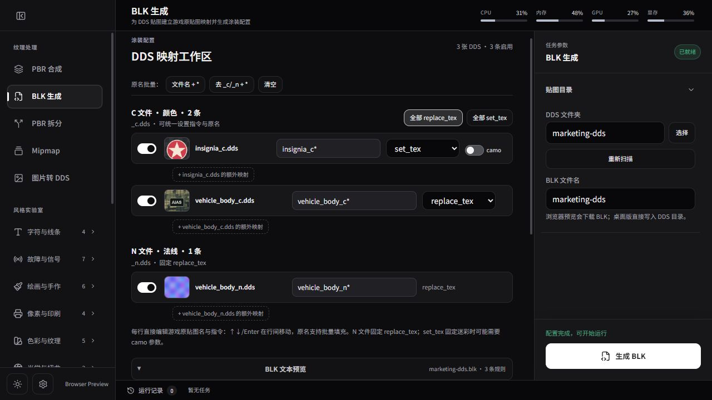
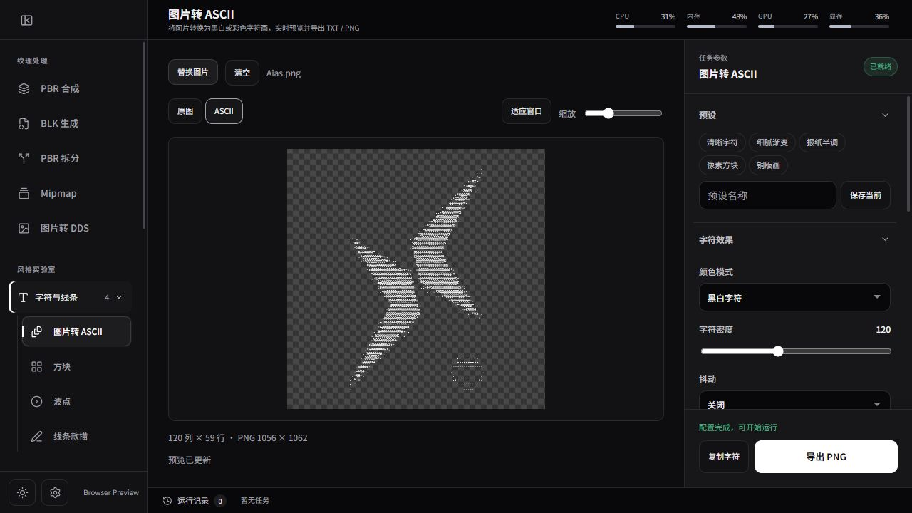

# AIAS

**A Windows texture workshop for War Thunder skin creators.** Combine PBR channels, build DDS textures and BLK mappings, bake Mesh Maps, and manage user skins in one desktop app.

[简体中文](README.md) · **[Download AIAS v5.7.0 for Windows](https://github.com/AvroraCL/AIAS/releases/download/v5.7.0/AIAS_5.7.0_x64-setup.exe)** · [Report an issue](https://github.com/AvroraCL/AIAS/issues)

The screenshot shows the real BLK workspace with generated sample textures. AIAS is an independent community project and is not affiliated with or endorsed by Gaijin Entertainment.

## A typical skin workflow

1. **Build PBR textures:** combine base color, roughness, metallic and normal inputs into game-ready `_c` and `_n` DDS files.
2. **Create the BLK mapping:** scan the DDS folder, review each source-to-file rule and generate a `.blk` configuration beside the textures.
3. **Check and manage the skin:** use the built-in skin manager to find, import and enable War Thunder UserSkins.

For smart-material workflows, the model baker generates AO, normal, curvature, position, thickness, ID and UV Mesh Maps from the **same static model**. It is not a high-poly-to-low-poly projection baker. OBJ, GLB and glTF import are supported; the source model is not overwritten. Native tiled UVs are preserved. Results report texture pixels shared by multiple surfaces; when baking geometry-dependent maps with substantial reuse, an extra `uv_unique_mask` PNG (white = uniquely mapped, black = shared or uncovered) helps limit those maps to reliable regions.

AIAS also provides PBR splitting, mipmap generation, batch image-to-DDS conversion, 29 image styles including ASCII art, local background removal, 4× upscaling and normal/height map generation. Processing runs locally; optional AI models and acceleration runtimes are downloaded on demand.

## Install

- Windows 10 or 11: [download the latest installer](https://github.com/AvroraCL/AIAS/releases/latest).
- v5.7.0 installer SHA-256: `827cf9b638f8265ebabb939fc53471e6c990ef99f54278bb21ebc51b50191b64`.
- The app checks for updates at startup when automatic update checks are enabled in Settings.

The [Chinese README](README.md) contains the full feature reference, requirements and build instructions. Source code is licensed under [LGPL-3.0](LICENSE).
